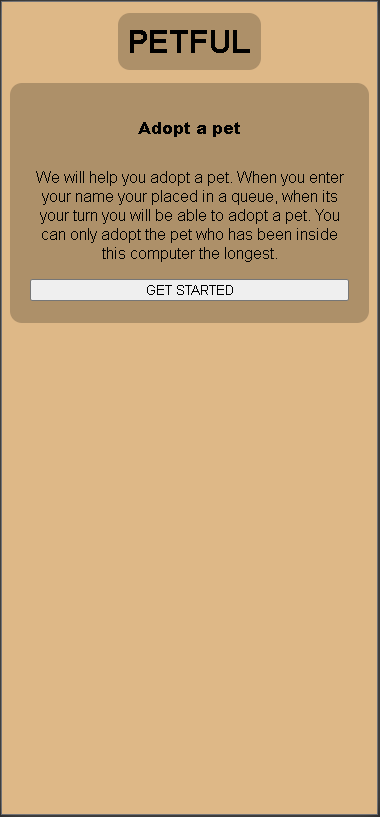
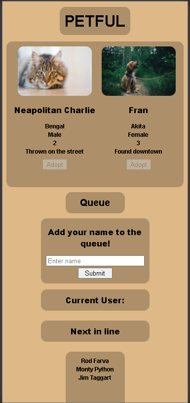

# Petful Client

[Live App]http://dsa-petful-client.bandocoder.vercel.app
[Client Repo]https://github.com/BandoCoder/DSA-petful-client
[Server Repo]https://github.com/BandoCoder/DSA-petful-server

This project was bootstrapped with [Create React App](https://github.com/facebook/create-react-app).

## About

This project is a demo for pet adoption. It simulates adopting a pet through a queue.

## Tech

React, Node.js(server)

## Screenshots

